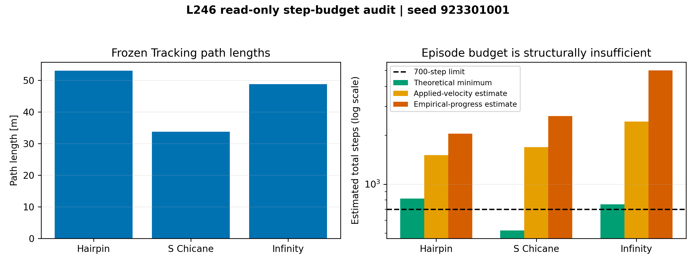
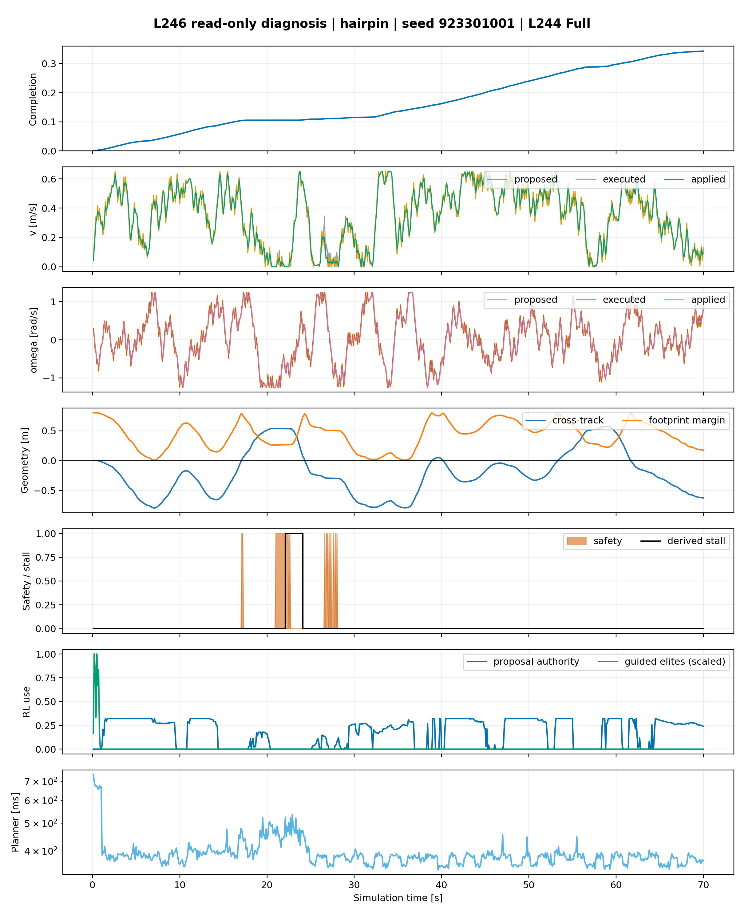
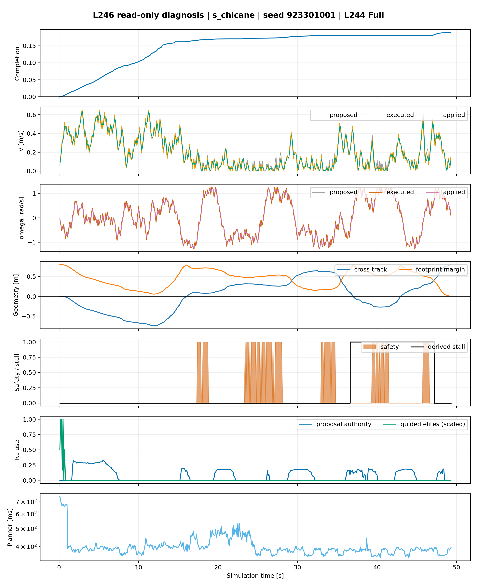
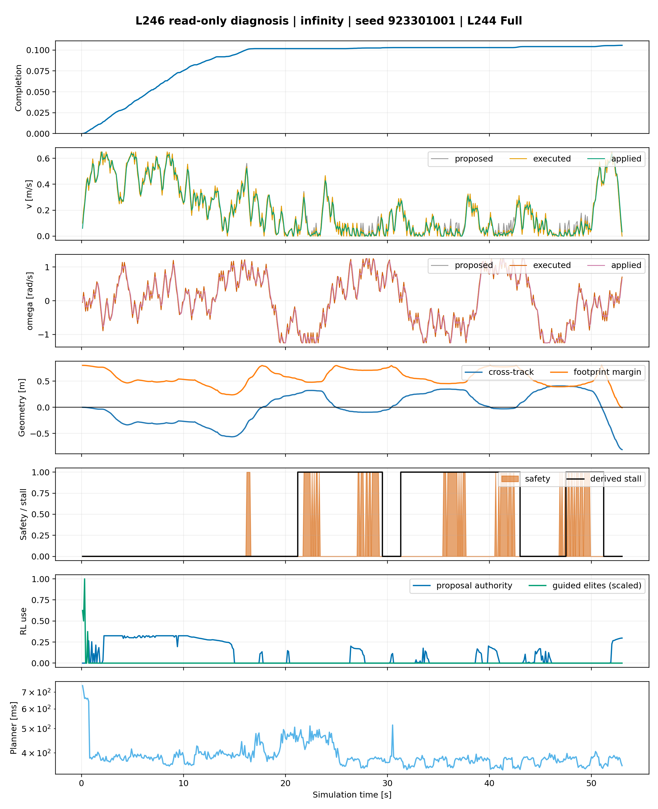
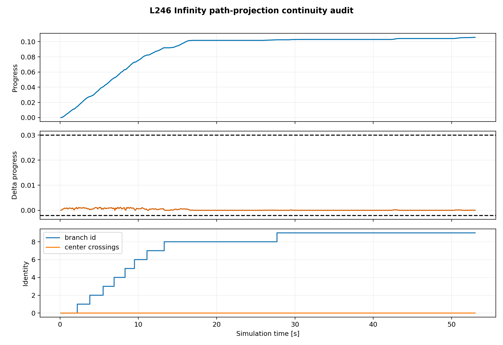

# L246 Tracking 失败根因只读审计报告

## Material Passport

- Origin Skill: academic-research-suite / experiment-agent
- Origin Mode: validate
- Origin Date: 2026-07-21
- Verification Status: ANALYZED
- Version Label: l246_root_cause_audit_v1
- Frozen Protocol Commit: `5172f04`
- Source Experiment: L244 BC-anchored Path Actor Tracking Development Gate
- Source Seed: `923301001`
- Source Physics: `nominal_seen`
- Source Git SHA: `edf9e1a419e1af899cb1feda88c774d95b99bde8`
- Coupled Actor SHA256: `e8e446cbe9a9520a4053012a28995e63238a85dae4f0462e5574e2a0c0746c3c`

## 1. 审计结论

L244 的“0/3 完整成功”不能全部归因于 RL 或 ICODE 失效。只读审计发现三个相互独立的问题：

1. **固定 700-step 上限对 Hairpin 和 Infinity 在物理上不可能完成。** Hairpin 和 Infinity 即使始终以最大线速度 0.65 m/s 行驶，理论最少仍分别需要 816 和 750 步。
2. **S-Chicane 和 Infinity 并非跑满步数，而是在边界越界时提前终止。** 它们分别在第 493 和 530 步发生仅一步的 footprint boundary violation 并结束。
3. **三个场景都出现长时间低推进、反复转向。** Actor proposal 有非零作用，但 82%–92% 的时刻处于 proposal fallback；安全层并不是三个场景共同的唯一主因。

此外，三个回合的 planner p99 为 653–674 ms，相对冻结的 100 ms deadline 为 100% miss。这不直接造成同步 MuJoCo 中的轨迹失败，但意味着当前 CPU 实现尚不满足 10 Hz 实时部署要求。

因此，当前最优先的不是扩大网络或继续堆训练，而是先修正实验的**任务预算公平性**，随后再把 footprint 边界约束前移到 MPPI 候选评价阶段。只有这两项基础条件合理后，补困难状态数据才具有可解释性。

---

## 2. 输入完整性

本轮没有启动 MuJoCo、没有重新训练、没有读取 sealed seed。分析脚本只读取：

```text
tracking_l244_bc_anchor_hairpin_seed923301001
tracking_l244_bc_anchor_s_chicane_seed923301001
tracking_l244_bc_anchor_infinity_seed923301001
```

三个输入均满足：

- `pipeline_qualification`；
- seed `923301001`；
- L244 Git SHA `edf9e1a...`；
- selected Actor SHA256 `e8e446cb...`；
- `full_proposed`；
- nominal seen physics；
- 轨迹、resolved config、metrics 和 provenance 工件完整。

每个输入文件的 SHA256 已写入：

```text
docs/experiments/post_l217/tables/l246_analysis_manifest.json
```

---

## 3. 路径长度与 700-step 预算

冻结控制周期为 0.1 s，最大线速度为 0.65 m/s。理论最少步数不包含转向、避障、安全仲裁、加减速或跟踪误差，因此它只是一条不可突破的物理下界。

| 场景 | 路径长度 | 实际回合步数 | 最终完成度 | 理论最少步数 | 按 applied v 估计 | 按实际推进率估计 | 理论余量 vs 700 |
|---|---:|---:|---:|---:|---:|---:|---:|
| Hairpin | 53.023 m | 700 | 0.3422 | **816** | 1,509 | 2,046 | **-116** |
| S-Chicane | 33.706 m | 493 | 0.1879 | 519 | 1,689 | 2,625 | +181 |
| Infinity | 48.715 m | 530 | 0.1057 | **750** | 2,423 | 5,015 | **-50** |

### 3.1 解释

- Hairpin：即使忽略所有转弯和障碍，700 步也无法走完 53.0 m，因此 `max_steps` 是确定的主根因。
- Infinity：同理，理论下界已经超过 700；而实际在 530 步时又因 boundary violation 提前结束。
- S-Chicane：理论预算足够，但其实际平均 applied v 只有 0.1996 m/s，并且在第 493 步越界终止。它的失败不是单纯的上限问题。
- 三场景按实际推进率估算均远大于 700，说明即使修正 episode 上限，控制效率、转向停滞和边界问题仍需后续处理。



---

## 4. 三场景逐拍根因

### 4.1 Hairpin

| 指标 | 结果 |
|---|---:|
| 终止原因 | `max_steps` |
| 边界违规 | 0 steps |
| 最小 footprint margin | +0.0072 m |
| 首个预注册停滞窗口 | step 221 / 22.1 s |
| 停滞窗口安全占比 | 0.26 |
| 停滞窗口平均绝对角速度 | 0.933 rad/s |
| metrics stuck / spin | 35 / 24 steps |
| Actor authority mean / max | 0.1759 / 0.3217 |
| proposal fallback mean | 0.8241 |
| guided elites | 30 |

证据显示机器人在约 18–29 s 之间多次把线速度压到接近零，同时维持较大角速度；停滞窗口安全覆盖率仅 26%，未达到安全密集阈值。因此该段更符合**反复转向/局部最小值**，而不是 scan_guard 长期禁止前进。之后机器人重新推进，最终仍受 700-step 上限截断。

主根因：`step_budget`。  
次根因：`repeated_turning_local_minimum`、Actor 大部分时刻 fallback、planner 实时性不足。



### 4.2 S-Chicane

| 指标 | 结果 |
|---|---:|
| 终止原因 | `boundary_violation` |
| 终止步 | 493 |
| 边界违规 | 1 step |
| 最小 footprint margin | -0.0027 m |
| 首个安全密集窗口 | step 265 |
| 最密集 50-step 安全占比 | 0.74 |
| 首个停滞窗口 | step 366 / 36.6 s |
| 停滞窗口平均绝对角速度 | 0.734 rad/s |
| metrics stuck / spin | 61 / 58 steps |
| Actor authority mean / max | 0.0755 / 0.3243 |
| proposal fallback mean | 0.9245 |
| guided elites | 25 |

S-Chicane 前约 16 s 能持续推进，随后在急弯/障碍附近出现多段安全介入、低线速度与饱和式转向。第 493 步的最大横向误差、最小 boundary margin 和终止发生在同一步，说明失败是明确的**footprint boundary termination**，而不是 terminal logic。

主根因：`candidate_boundary_cost_or_termination`。  
次根因：安全密集窗口、反复转向、Actor 大部分时刻 fallback、planner 实时性不足。



### 4.3 Infinity

| 指标 | 结果 |
|---|---:|
| 终止原因 | `boundary_violation` |
| 终止步 | 530 |
| 边界违规 | 1 step |
| 最小 footprint margin | -0.0072 m |
| 首个停滞窗口 | step 212 / 21.2 s |
| 停滞窗口安全占比 | 0.06 |
| 停滞窗口平均绝对角速度 | 0.693 rad/s |
| metrics stuck / spin | 93 / 95 steps |
| Actor authority mean / max | 0.0961 / 0.3247 |
| proposal fallback mean | 0.9039 |
| guided elites | 20 |

Infinity 在前 18 s 达到约 10% 完成度，之后多次出现低推进和反复转向，最终在第 530 步越界终止。理论下界为 750 步，因此即使没有越界，原 700-step 上限仍不足。

主根因：`step_budget` + `candidate_boundary_cost_or_termination`。  
次根因：反复转向、Actor 大部分时刻 fallback、planner 实时性不足。



---

## 5. Infinity 中央交叉与路径投影

预注册阈值下：

- branch identity 正常地从 0 递增到 9，共 9 次相邻变化；
- progress regression 事件：0；
- progress jump 事件：0；
- `center_crossing_count` 变化：0。

这不能证明 Infinity 中央交叉投影正确，因为机器人在越界终止前**根本没有到达中央交叉事件**。当前证据只能说明：已走过的前 10.6% 路径没有发现 projection discontinuity。

所以中央交叉问题的状态是 `center_not_reached`，不是“已通过”，也不是“已检测到错误”。



---

## 6. Actor proposal 审计

| 场景 | Mean authority | Max authority | Mean fallback | Guided elites |
|---|---:|---:|---:|---:|
| Hairpin | 0.1759 | 0.3217 | 0.8241 | 30 |
| S-Chicane | 0.0755 | 0.3243 | 0.9245 | 25 |
| Infinity | 0.0961 | 0.3247 | 0.9039 | 20 |

Actor 并非没有被使用：三个场景都有非零 authority 和 guided elites。但 82%–92% 的平均 fallback 表明它只在少量时刻获得有效提议权。当前不能仅凭相关性断言“fallback 导致失败”；更准确的结论是：**Actor 已参与，但还不是稳定主导候选分布的 proposal source。**

这与后续补充困难恢复数据的建议一致，但它不是修复不公平 step budget 和候选边界约束的替代品。

---

## 7. Planner 实时性

| 场景 | p50 | p95 | p99 | Deadline | Miss rate |
|---|---:|---:|---:|---:|---:|
| Hairpin | 383.2 ms | 471.0 ms | 664.9 ms | 100 ms | 100% |
| S-Chicane | 387.6 ms | 481.5 ms | 673.7 ms | 100 ms | 100% |
| Infinity | 381.4 ms | 472.4 ms | 653.2 ms | 100 ms | 100% |

该结果是明确的实时性红旗。当前 MuJoCo 回合按仿真时间同步推进，因此 planner 墙钟耗时不会改变仿真中的 0.1 s 状态步进；不能把它说成当前轨迹失败的直接原因。但如果迁移到 10 Hz 实车控制，当前 CPU 实现无法满足 deadline，后续必须进行向量化/GPU 或预算优化。

---

## 8. 冻结根因表

| 场景 | 主根因 | 次根因 | 当前不能下的结论 |
|---|---|---|---|
| Hairpin | 700-step 预算物理不可能 | 反复转向、proposal 多数 fallback、实时性 | 不能说 Actor 无法完成整条 Hairpin |
| S-Chicane | 候选级边界/越界终止 | 安全密集、反复转向、proposal 多数 fallback、实时性 | 不能说只要延长步数就能成功 |
| Infinity | 预算物理不可能 + 越界终止 | 反复转向、proposal 多数 fallback、实时性 | 不能评价中央交叉 branch 投影 |

---

## 9. 下一步建议

严格按单变量顺序：

### L247：先修正 episode budget 公平性

将固定 700 steps 改为**由冻结路径长度计算、对同一场景所有方法完全相同**的上限。建议在新协议中冻结：

```text
max_steps(scene) = ceil(1.25 × path_length / (0.30 m/s × control_dt))
```

按当前路径约为：Hairpin 2,210，S-Chicane 1,405，Infinity 2,030 steps。该变更只修复“考试时间不可能完成”的设计错误，不改模型、cost、地图或安全链。

由于 S-Chicane/Infinity 会在越界时提前终止，L247 不应被期待单独解决三场景成功问题；它的作用是建立合法、可比较的 success denominator。

### L248：候选级 footprint boundary constraint

在 L247 预算冻结后，再按意见中的 margin/barrier 方案把边界约束前移到所有 MPPI arms 的候选评价阶段。不能继续依赖最终动作 buffer，也不能放松安全判据。

### 之后才进入恢复数据与重训练

只有 episode budget 与 candidate boundary 两项基础条件通过后，再收集 Hairpin/S-Chicane/Infinity 的困难恢复状态，扩展到 100k–300k transitions，并进行三 seed Actor 训练。

---

## 10. 统计与推断边界

本轮是单 seed、既有轨迹的确定性诊断，没有进行显著性检验或置信区间计算。

### Fallacy scan：11/11 checked

| 类型 | 状态 | 说明 |
|---|---|---|
| Simpson's paradox | CAUTION | 三场景根因不同，不允许只用平均完成度描述。 |
| Ecological fallacy | CAUTION | 单 seed 场景结论不能推广到所有 seed。 |
| Berkson's paradox | NOTE | 本轮只分析 L244 Full 失败回合，属于条件样本。 |
| Collider bias | NOTE | 安全介入、低速度和困难几何相互影响，不能把条件相关当单向因果。 |
| Base-rate neglect | CAUTION | 只有一个 seed，不能估计失败基率。 |
| Regression to the mean | CAUTION | 后续新 seed 的改善不能与单个极端 seed 简单比较。 |
| Survivorship bias | NOTE | 三个失败回合全部保留，没有只看成功轨迹。 |
| Look-elsewhere effect | CAUTION | L236–L245 是多轮 development；L246 只用于诊断，不是确认性结果。 |
| Garden of forking paths | MITIGATED | L246 阈值与判定顺序已在 commit `5172f04` 预注册。 |
| Correlation != causation | CAUTION | fallback、安全介入与停滞共现不证明其单独造成失败。 |
| Reverse causality | CAUTION | 高安全介入可能是困难状态的结果，而非初始原因。 |

总体置信等级：`SOLID` 用于路径长度、理论下界、终止原因和日志事实；`CAUTION` 用于控制行为的根因解释。

---

## 11. 复现与文件索引

运行命令：

```bash
MPLBACKEND=Agg .venv/bin/python \
  experiments/rl/analyze_l246_tracking_root_causes.py
```

测试：

```text
python -m py_compile: PASS
pytest tests/rl/test_l246_tracking_root_cause_analysis.py -q: 5 passed
```

输出表：

```text
docs/experiments/post_l217/tables/l246_tracking_step_budget.csv
docs/experiments/post_l217/tables/l246_tracking_key_events.csv
docs/experiments/post_l217/tables/l246_root_cause_classification.csv
docs/experiments/post_l217/tables/l246_infinity_projection_events.csv
docs/experiments/post_l217/tables/l246_analysis_manifest.json
```

输出图：

```text
docs/experiments/post_l217/figures/fig_l246_step_budget_summary.{png,pdf}
docs/experiments/post_l217/figures/fig_l246_hairpin_timeseries.{png,pdf}
docs/experiments/post_l217/figures/fig_l246_s_chicane_timeseries.{png,pdf}
docs/experiments/post_l217/figures/fig_l246_infinity_timeseries.{png,pdf}
docs/experiments/post_l217/figures/fig_l246_infinity_projection.{png,pdf}
```

## 12. 一句话结论

**L244 的失败不是单一“RL 没训练好”：Hairpin/Infinity 的 700-step 设计本身不允许完整成功，S-Chicane/Infinity 又被候选级边界问题提前终止；先修正这两项实验基础条件，才有资格判断困难状态数据和 Actor 训练是否充分。**

