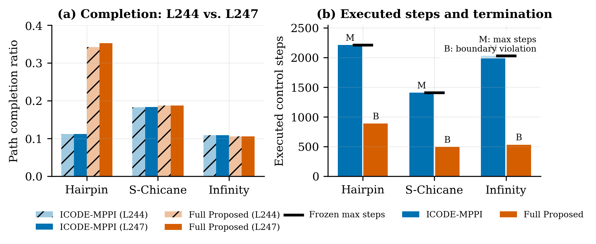

# L247 Tracking 公平回合预算 Development 报告

## Material Passport

- Verification Status: ANALYZED
- Frozen Protocol Commit: `2da62df`
- Development Seed: `923301001`
- Physics: `nominal_seen`
- MuJoCo: `3.2.3`
- Independent experimental unit: seed（本轮仅 1 个 development seed）

## 1. 结论

L247 的**实验设计 Gate 通过**：三个场景都使用了预注册的场景特定预算，Hairpin 和
Infinity 不再被旧的 700-step 上限截断。但这是设计有效性通过，不是性能通过。

最终 6 个回合成功数为 **0/6**，碰撞数为 **0/6**。Full Proposed
在三个场景均因单步 footprint boundary violation 提前终止；ICODE-MPPI 在三个新预算内
均运行至 max steps，但长期停滞，完成度基本没有随预算增加。

这说明 L246 的判断成立：延长回合只消除了不公平的时间上限，不能解决候选轨迹越界和
局部最小值。下一步应按冻结路线进入 L248，将 footprint boundary constraint 前移到所有
MPPI arms 的候选评价阶段，而不是继续增加步数或立即扩大网络。

## 2. 最终结果

| 场景 | 方法 | 步数/预算 | 终止 | 完成度 | 碰撞 | 边界步 |
|---|---|---:|---|---:|---:|---:|
| Hairpin | ICODE-MPPI | 2210/2210 | max_steps | 0.1122 | 0 | 0 |
| Hairpin | Full Proposed | 885/2210 | boundary_violation | 0.3526 | 0 | 1 |
| S-Chicane | ICODE-MPPI | 1405/1405 | max_steps | 0.1832 | 0 | 0 |
| S-Chicane | Full Proposed | 493/1405 | boundary_violation | 0.1877 | 0 | 1 |
| Infinity | ICODE-MPPI | 2030/2030 | max_steps | 0.1087 | 0 | 0 |
| Infinity | Full Proposed | 530/2030 | boundary_violation | 0.1055 | 0 | 1 |

## 3. 与 L244 的只读配对比较

- Full 平均完成度：`0.2118` → `0.2153`，变化 `+0.0035`；
- ICODE 平均完成度：`0.1343` → `0.1347`，变化 `+0.0004`；
- Full 的 boundary violation 总步数：`3`，三个场景各 1 步；
- Hairpin Full 从 L244 的 700-step max termination 延长到 step 885，随后越界；
- S-Chicane 与 Infinity Full 的终止步和完成度与 L244 基本一致，说明预算不是其主根因；
- ICODE 虽运行到 1405–2210 步，完成度只变化约 0.0003–0.0005，表明长期安全抑制/停滞。



## 4. Gate 判定

```json
{
  "gate_passed": true,
  "structural_problems": [],
  "old_700_step_limit_failures": [],
  "interpretation": "success denominator repaired; this is not a performance pass"
}
```

Gate 通过仅允许进入 L248 development，不允许注册 sealed Tracking，也不能作为论文正式结论。

## 5. 推断边界

本轮只有一个 development seed，没有进行显著性检验或置信区间估计。L244 与 L247 使用相同
seed、地图和方法，因此可做确定性的工程配对诊断；不能据此宣称总体成功率或跨 seed 优势。
全部失败均已保留，没有筛 seed、删除负向回合或修改核心 RL+ICODE 机制。

## 6. 输出索引

```text
docs/experiments/post_l217/tables/l247_episode_results.csv
docs/experiments/post_l217/tables/l247_vs_l244_paired.csv
docs/experiments/post_l217/tables/l247_gate_audit.json
docs/experiments/post_l217/tables/l247_input_manifest.json
docs/experiments/post_l217/figures/fig_l247_budget_effect.png
docs/experiments/post_l217/figures/fig_l247_budget_effect.pdf
```
