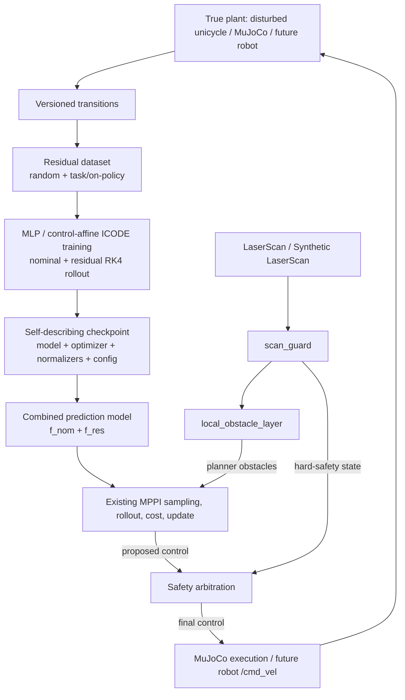
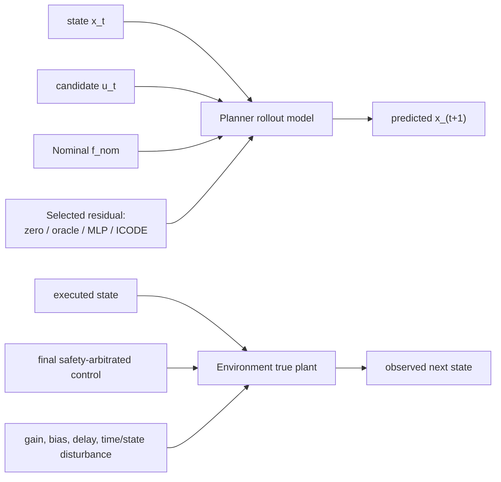
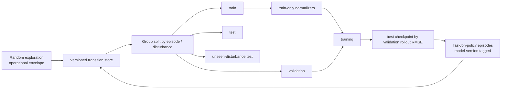

# ICODE Residual Dynamics Research Architecture

## 1. System view



The learned model changes only the forward-prediction block. It does not
replace perception, obstacle representation, trajectory cost, control
weighting, Memory, or safety arbitration.

## 2. Dynamics and plant separation



This boundary prevents data leakage. A learned planner model sees only its
checkpoint and normalizers. The environment owns the mismatch parameters.
Only `oracle_residual` experiments deliberately expose `f_true - f_nom` to the
planner and are labeled as upper-bound/interface checks.

## 3. Core interfaces

`DynamicsModel` exposes a finite derivative for one state and control:

```python
class DynamicsModel(Protocol):
    state_dim: int
    control_dim: int

    def derivative(self, state, control, time=None):
        ...
```

`integrate_step` supports Euler and RK4, validates shape/finiteness and
positive `dt`, and wraps configured angular state indices after the complete
step. MPPI uses an adapter around this interface so its default path remains
the legacy Euler implementation.

Four prediction modes share the same boundary:

| Mode | Residual used by planner | Intended role |
|---|---|---|
| `nominal` | zero | unchanged baseline |
| `oracle_residual` | exact `f_true - f_nom` | interface check and attainable upper bound |
| `mlp_residual` | `MLP(encoded_state, control)` | unstructured learned baseline |
| `icode_residual` | `f_theta(encoded_state) + G_theta(encoded_state) control` | control-affine structural ablation |

The first implementation remains state/control-dimension configurable. The
current configuration is `state=(x,y,theta)` and `control=(v,omega)`; a future
bicycle model can implement the protocol without changing MPPI.

## 4. Residual and state encoding

The ICODE residual has batch shapes:

```text
encoded state z     [B, nz]
control u           [B, nu]
drift f_theta(z)    [B, nx]
gain G_theta(z)     [B, nx, nu]
G_theta(z) u        [B, nx]
residual derivative [B, nx]
```

For the current unicycle, `nx=3`, `nu=2`, and the recommended encoder is
`[x, y, sin(theta), cos(theta)]`. Encoding the angle with sin/cos removes the
input discontinuity at `+pi/-pi`; the output remains `[dx,dy,dtheta]` because
the ODE integrates the original physical state. State losses use
`atan2(sin(delta_theta), cos(delta_theta))` for heading error.

## 5. Data lifecycle



The compact training artifact is NPZ plus JSON metadata and CSV summary. Every
dataset records time, Git SHA, complete config, seeds, dimensions, provenance,
episode count, transition count, and disturbance metadata. Timestep-level
random splitting is forbidden.

## 6. Loss mapping

- Residual derivative loss validates finite-difference labels and gives a
  direct supervised signal.
- One-step combined RK4 state loss corresponds to ICODE-MPPI Eq. (12).
- H-step combined rollout loss is a documented extension that targets MPPI's
  horizon behavior; heading differences are wrapped at every horizon step.
- Regularization is configurable and defaults to a small weight.

Model selection uses validation H-step rollout RMSE, not training derivative
loss alone.

## 7. MPPI and future sampling priors

`rollout_control_sequence(..., dynamics_model=None)` preserves the original
three-argument behavior. A non-`None` model is handled by
`MppiDynamicsAdapter`. No cost, weighting, obstacle, or safety code needs to
know whether the model is nominal, oracle, MLP, or ICODE.

Sampling warm starts are separated behind `SamplingPrior`:

```text
PreviousSequencePrior  (implemented now)
GoalWarmStartPrior     (implemented now)
RLPolicyPrior          (future; not implemented in this phase)
```

The MPPI sampler therefore has no current dependency on a PyTorch RL policy.

## 8. Experiment layers

1. **Dynamics-only clean benchmark** isolates model mismatch from perception,
   obstacle representation, and safety arbitration.
2. **Prediction benchmark** compares nominal, oracle, MLP, and ICODE at
   horizons 1/5/10/20, including unseen disturbances and inference time.
3. **Control benchmark** compares the same prediction modes under an executed
   true plant with fixed goal `(3.0,3.0)` and multi-seed reporting.
4. **Formal MuJoCo scenario benchmark** retains synthetic LaserScan,
   scan guard, local obstacles, and safety arbitration. Memory is off for the
   primary ICODE ablation and can be studied only in a separately named factor.

Smoke runs prove wiring and reproducibility only. They are not paper results.

## 9. Scope and claims

This framework is a compatible unicycle adaptation of the residual-learning
and MPPI-integration mechanism described by ICODE-MPPI. It is not a reproduction
of the paper's five-state bicycle experiments. It also does not enforce or
verify the original ICODE contraction metric/Jacobian conditions. Formal
stability, convergence, safety, and real-robot performance claims are outside
the implemented evidence.
