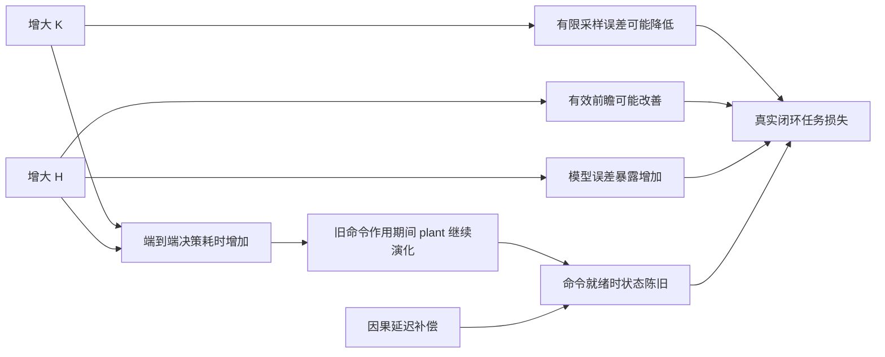

# Physical Trade-off SAC-MPPI：冻结门槛下的 Phase 4 停止报告

日期：2026-09-07。**最终判断：NO-GO，停在 Phase 4，不进入 SAC。**

停止依据是本轮冻结的跨速度 reliability prerequisite 未通过；不是证明物理
K/H trade-off 不存在。采样方差—计算延迟的局部机制有正向证据，但尚未验证
高计算量导致闭环任务损失、内点最优、补偿后的收益空间或学习方法优势。

## Material Passport

用户定义科学问题、阶段顺序、比较条件和停止纪律。AI 完成接口实现、原文核验、
具体门槛操作化、实验执行、审计和报告。门槛在新机制数据产生前冻结于
`018e238`，因已有8步安全前缀而修改 Hmin 的工程修订冻结于 `3a494a8`。
全部数据为本地 CPU MuJoCo 仿真；没有正式 RL 训练，也没有外部模型数据上传。
上一轮两个 NO-GO 目录与报告相对 `9bcaa77` 无改动，审计已验证。

## 1. Scientific question

本轮问：有限采样精度、规划前瞻、模型误差累积和计算诱发的状态陈旧，是否共同
产生随场景、速度、模型可靠性变化的 MPPI 最佳 K/H？只有这些机制及可利用收益
先被证实，才讨论让 SAC 学习 operating point。

## 2. Why previous formulation failed

旧项目的开发结论保持原样：PPO 未学出有价值的联合分配，完整策略未优于便宜
固定参照；最后216条分支的跨采样收益仅+2.45%，未达冻结10%继续门槛。
它没有把决策耗时真实送进物理转移。本轮不是对旧失败重新评分或重解释。

## 3. Physical trade-off derivation

概念分解为

`J_meta = J_ideal + Delta_MC + Delta_short + Delta_model + Delta_delay`。

这是组织假设的科学分解，尚非可辨识的严格加性定理。各项可能交互；有限 K 的
自归一重要性估计不保证方差单调下降，较长 H 也未必损害控制。

Figure 1：下面是**待检验的因果假设图**，不是凭空绘制的实验曲线。



## 4. Computation-delay semantics

新增 `PhysicalDecisionDelayWrapper`：记录 sensed state，旧命令在计算期间继续
通过原执行器产生物理运动，命令就绪后才提交新命令。MuJoCo 在命令就绪和原有
执行器队列的激活时刻拆分步长，PI、扭矩 slew 等使用真实子步 dt。每周期物理时间
严格累计到0.1s，没有 sleep，也不靠四舍五入积累时钟偏差。

原有40ms执行器传输延迟仍保留，不能与新增 computation delay 混为一谈。本轮
采样图报告的是 **command-ready staleness**；新命令真正改变执行器还要经过
原延迟。最终接口另提供实际激活时刻/陈旧状态，若跨周期则标记 pending。
该补充只有日志与单元测试，没有重算、覆盖原机制结果。

`tau>=Tc` 时旧命令保持整个周期，丢弃迟到结果，完整 tau 仍保存。这是明确的
hard-deadline/drop 模拟抽象，并非声称超时计算可在真实处理器上无代价重叠。
原有队列里之前已提交的命令仍会正常激活。

端到端计时覆盖 causal context、policy callback、K/H配置、可选预测补偿、MPPI。
训练梯度、物理积分、记录和文件输出不计入。此阶段没有 SAC，profile 不伪称包含
已训练 actor；仅另测64/64网络前向开销，P99约0.196ms，供条件通过后的净收益扣除。
当前边界到 MPPI proposed command ready，随后安全仲裁的微小开销未加入；未来正式
整机 sensor-to-driver qualification 需包含该项。故不能称为整机实时保证。

## 5. Sampling uncertainty evidence

Easy/Medium × low/high 的4条冻结参照历史，在0/20/40步保存12个状态。
每状态 H=20，K=16/64/128/256，每 K32个规划噪声种子，共 **1536 次规划**。
环境种子为0；这不是12个独立场景，也不是1536个独立导航 episode。

| K | 完整 first-action 方差 | U_MC | 平均状态内中位决策延迟 | 平均就绪位置漂移 |
|---:|---:|---:|---:|---:|
| 16 | 0.04512 | 0.10372 | 12.80ms | 3.10mm |
| 64 | 0.04465 | 0.07312 | 16.18ms | 3.87mm |
| 128 | 0.03536 | 0.05439 | 20.48ms | 4.89mm |
| 256 | 0.03591 | 0.05168 | 29.27ms | 6.79mm |

K16→256，聚合 first-action 方差下降 **20.399%**，仅略超过预先20%门槛；
10/12状态方差下降，但 `easy_low_20` 和 `easy_low_40` 分别上升约687%与261%。
K128到256的聚合方差略升。不能写成 `1/sqrt(K)` 已被普遍验证。

实际经过执行器限幅的 command 方差从0.01398降至0.01107，约20.8%。初始状态
有动作被限幅为相同结果的情况，原始 Monte-Carlo 更新与执行动作必须分别看待。

U_MC 使用4个互斥分组，各组局部重归一权重，估计首动作，再求无偏组间协方差
的 trace。不额外 rollout，也不抽额外随机数。它表示 K/4样本估计器的分散，
**不是完整 K估计器的校准置信区间**。v与omega以原始单位进入 trace，尚未建立
任务敏感度加权。12个状态内，U_MC与独立高K参照偏差的秩相关为0.076–0.390；
这是弱到中等描述性联系，不等于证明预测闭环 regret。

高K参照来自另一半噪声种子的均值，选择和评分不共享该半样本；它仍是有噪声的
有限K参照，不能称为最优真值。preliminary sampling gate通过，**physical K
interior/task-regret gate尚未运行**。


## 6. Foresight evidence

未运行新的闭环 H sweep。H=1/5/10/20/30/40的预测误差数据不能替代
shortsightedness、dead-end choice、成功率和任务代价证据。旧 landscape不混入新结论。

## 7. Reliability × horizon evidence

采用32条新命令序列（每速度16条），每条在A/B两种 plant重放，共 **64条物理轨迹、
2560个0.1s控制周期**。每条同时计算nominal和同一冻结L57 ICODE预测。
记录position、wrapped heading、v、omega和归一化误差。

A为现有L70 plant，B为原default plant；在产生数据前仅称A/B。预测使用其既有
传输延迟的 interval-average近似，模型误差包含该近似的影响。初始身体/轮速按
rolling状态一致初始化，未跨MJCF移植snapshot。低/高速各用新随机命令bank；
**同速度下 A/B 完全配对，跨速度不是同一归一化命令bank**。

H=40的结果：

| 速度包络 | A nominal位置RMSE | B nominal位置RMSE | B ICODE位置RMSE | 校正位置变化 | 校正归一化变化 |
|---|---:|---:|---:|---:|---:|
| low，v上限0.25m/s | 0.03809m | 0.04854m | 0.05421m | **+11.69%** | **+3.88%** |
| high，v上限0.65m/s | 0.15585m | 0.25790m | 0.20133m | **−21.94%** | **−35.39%** |

B/A nominal位置/归一化RMSE比分别为low1.274/1.297、high1.655/1.619，均超过
预先1.20对照阈值。因此A/B模型误差对照存在。但要求“ICODE在每个速度包络同时
降低至少10%的H40位置和归一化误差”时，low失败、high通过，**整体 prerequisite失败**。
没有只报告high或把low删去。

低速B在H20校正位置误差由0.02144降至0.02010m，但H30/40转为恶化，说明其
误差行为随H变化。高速误差随H累积且校正部分缓解。二者都只是预测证据，不能
直接推断最优闭环H或reliability input的价值。


## 8. Speed × latency evidence

已有采样保存状态显示测得延迟越长，就绪时位置漂移通常越大。Figure4仅是这些
状态的描述性散点：速度组也涉及不同状态与控制历史。预定相同场景/状态、注入
0/20/50/80ms及10周期任务后果的Phase5未运行，不能称Gate D通过。


## 9. Delay compensation

模型前向传播、冻结latency table、预测application-time observation接口已实现并
通过解析运动测试：从v=.4m/s、omega0状态保持同一命令37ms，预测x增加0.0148m。
不使用当前完成后才知道的tau或未来truth。

此模块作为Phase2接口的工程测试，不是Phase6补偿实验。补偿后trade-off是否
消失 **未知**。冻结table只支持已profile单元精确查表，拒绝隐式外推；若进入
连续SAC前需另行冻结覆盖全量整数动作的表/模型，当前没有伪称已支持全域。

## 10. Fixed K/H landscape

本轮完成1536个profile timing samples，冻结候选K=16/64/128/256、H=8/10/20/40。
**未运行Phase7的物理任务landscape**。配置和环境支持lambda_compute=0，
但不能把计时表或上一轮任务表当作本轮零价格闭环表现。

硬件：Intel Core i9-14900HX，WSL2 Ubuntu20.04，Python3.8.10、NumPy1.24.4、
PyTorch2.4.1+cpu、MuJoCo3.2.3，Torch/BLAS线程均1，CUDA不可用。
K256/H40 residual的P95=53.56ms、P99=54.99ms；K512/H40的P95=86.23ms，
超过冻结80ms余量阈值，因此不选入范围。32次分位数仅是开发描述。
初始cold call另存：nominal3.93ms、residual43.65ms，不混入稳定profile却也未删除。
profile取初始观测，动态状态下context开销可能不同，不能称全场景P99认证。

## 11. Explicit trade-off model

未拟合response surface，原因是没有获得满足前置门槛的fixed-grid task data。
预定无符号约束的响应面、分组交叉验证和可执行heuristic判据保存在协议中。
没有为获得正向机制而强制系数符号，也没有宣称heuristic弱于SAC。

## 12. Oracle headroom

未计算本轮context oracle或best fixed任务损失，净headroom未知。原先+2.45%的
结果属于旧reward和无物理计算延迟的协议，不转移为本轮结论。10%跨重复净收益
门槛仍冻结，没有因Phase4失败而降低。

## 13. Bøhn baseline reproduction fidelity

[逐项fidelity文档](../baselines/bohn_rl_horizon_fidelity.md)区分三层：

- 2021原论文：SAC、tanh Gaussian、[-1,1]缩放到1..50并round，梯度基于未缩放
  未取整动作；32/32网络、gamma=rho=.97，task-specific computation/failure权重。
- learned terminal value：二次多项式、32-step bootstrap；fixed baselines也训练
  自己的terminal value。不能只给proposed这个机制。
- 作者后续rlmpcopt：属于另一篇论文，horizon-only入口用 **PPO2**，非原SAC。
  依赖TensorFlow1.15、Python<=3.7及自定义fork，当前环境未运行原作者训练。

原文未明确的replay capacity、update schedule、normalization等均标为未指定，
没有从记忆补成原论文事实。原文已讨论远处障碍不确定性影响长H价值。

## 14. SAC architecture

预定标准modern SAC：tanh Gaussian、twin Q、target Q、replay、soft update、
自动entropy、normalization及raw continuous replay/整数执行。**未实现/未训练**，
严格服从“Phase2–9 positive才进入Phase10”。只测过无训练64/64前向开销，
它不是SAC policy或算法smoke。

## 15. Reward

新环境实现 `r=-(C_task + lambda_fail*C_fail + lambda_compute*tau/Tc)`。
当前lambda_compute=0；没有旧potential-shaped return、residual/U_MC/KH/stale
惩罚。C_task是实际完成周期的goal-running distance²、时间加权实际命令effort、
accepted command rate和传感障碍influence，系数复用MPPI。
goal-terminal/terminal-heading不伪装成每步stage term；collision由独立failure
项按剩余episode步数计费，权重为既有collision_penalty/max_steps。
该adapter显式拒绝path-preview/path-boundary/memory任务，当前仅支持point-goal。
创新项使用已完成传感转移，执行器平均控制仅为模型预测近似。

## 16. Training protocol

T0/T1/T2/T3全部未运行。T1的一种子、短预算和后续升级逻辑保留在冻结协议；
没有因代码接口已写好而追加训练。未冻结具体训练超参数数值表，因为没有进入
允许训练的阶段；不能将这些计划称为完成的实验。

## 17. Baselines

复核旧ports接口：fixed nominal/ICODE、MPOPI、SIS/DTH principle port仍可复用，
旧SIS port没有原论文binary time grid fidelity。它们没有在本轮新物理语义下
完成正式比较，所以不报告“baseline全复现”。Bøhn B1原环境、B2共同backbone
SAC-H、B3 terminal-value变体及DM-MPPI均未运行。

## 18. Ablations

完成A/B nominal vs frozen residual的 **prediction ablation**，以及sampling
diagnostic on/off的控制输出/RNG等价测试。未做scene-only vs reliability-aware
learned KH、learned KH vs H-only、补偿开关任务比较或frozen-vs-measured完整episode。

## 19. Main results

| 阶段 | 状态 | 含义 |
|---|---|---|
| Phase0 独立分支/目录 | 完成 | 旧结果冻结 |
| Phase1 Bøhn fidelity | 完成原文/代码审读 | 未做作者训练复现 |
| Phase2 delay semantics | 工程通过 | fractional time、hold/drop、零延迟等价 |
| Phase3 sampling | preliminary pass | 方差下降20.4%，非普遍单调，无task-regret结论 |
| Phase4 reliability/H | **NO-GO** | 低速H40 ICODE未达到校正门槛 |
| Phase5–9 mechanism/landscape/headroom | 未运行 | 前置门槛失败 |
| Phase10–15 SAC/formal comparison | 未运行 | 禁止绕过门槛 |
| Phase16停止报告/已得数据分析 | 完成 | 非正式方法优越性结论 |

## 20. Performance-latency Pareto

没有新闭环性能landscape，不能构造有效的任务表现—latency Pareto或claim优势。
采样方差—latency曲线只回答局部估计器问题，不代替导航Pareto。

## 21. Statistical analysis and validation

仅描述性统计：均值、方差、分位数、秩相关、paired error ratios。没有正式T3，
所以不报告正式p值、95%CI、多重比较显著性或episode成功率优越性。
采样seed嵌套于状态，状态嵌套于4条历史；model probe以命令序列为配对单位。
没有把单episode控制steps当独立样本，也没有将两个速度bank当严格同轨迹因果对照。

审计重算所有profile、sampling variance、独立参照偏差和prediction error summaries，
**最大绝对差为0**。A_low/B_low/A_high/B_high各一条已存在的物理probe确定性重放，
状态轨迹最大差为0；这只是复现检查，不是新实验或重挑seed。
模型checkpoint/config哈希通过，源码与所记录commit核对通过。三份旧Python源码
有CRLF工作副本/LF Git blob差异，审计同时要求保存的精确工作字节SHA和仅换行符
不同的Git内容相等，不掩盖语义差异。

最终完整pytest **898 passed，45.10s**，包含新模块的13项测试。
最终全套验证及JUnit记录见
`research_artifacts/physical_tradeoff_2026-09-07/validation/`。

## 22. Policy behavior

没有trained allocation policy，所以不报告entropy、Q-values、K/H heatmap或
initialization departure。所有结果来自fixed预算诊断，不能称SAC选出的行为。
旧PPO记录属于另一个已冻结候选，不混入。

## 23. What SAC actually learned

**没有训练，未学习任何内容。** 因此也没有证据支持“SAC credit assignment失败”、
“action quantization难学”或“SAC不如fixed/H-only”。这些失败类型尚未被检验。

## 24. Failure cases

科学失败：低速B的H40位置误差从48.54mm增至54.21mm，归一化误差也略增；
它没有通过当前跨速度校正条件。没有重新训练/换ICODE checkpoint或删除低速bin。
有限采样效果也不稳：两个低速状态K增大时方差反升，K128→256平均收益消失。

工程记录全部保留：最初H5触发既有8步安全前缀校验，数据产生前改为H8；脚本
缺少SciPy，采样前改用等价NumPy ties-rank；sampling全部文件保存成功后stdout
序列化numpy.bool_报错，未重跑数据；首次source audit遇到CRLF差异，严格复核后
通过。这些工程问题与低速校正的数值失败分开报告。

失败分类：A trade-off不存在、B headroom小、C observation不可识别、D SAC学习失败、
E quantization、F compensation消除、G closed-loop reliability无关、H heuristic足够、
I SAC弱于fixed，**均尚不能定论**。当前直接证据是先于这些判定的operating-regime
模型校正prerequisite失败。

## 25. ICODE independent contribution

同一B物理轨迹上切换预测器，高速H40改善，低速H40恶化。这建立了受速度/命令
分布限制的 **预测器贡献**。没有训练D/E输入消融，不能claim reliability context
improves allocation。线上provider已有a/B norm、历史执行控制residual、ensemble
disagreement、support proxy和innovation，缺失值带mask；availability不是准确性保证。

## 26. Limitations

CPU、单environment seed开发历史、有限probe bank，未测试GPU或unseen geometry。
可靠性对照是fresh development calibration，不是formal OOD。
当前ground-truth-based传感隔离不证明轮式里程计下的部署表现。Sensing和真实
driver pipeline尚未计入全系统时间认证；profile在初始观测可能低估动态context。
stale norm是按预设量纲缩放的诊断，不是已校准任务损失。
sampling信号刚过20%门槛，未有独立场景复验；不应表述成坚实普适规律。
本次冻结了“两个速度均有效”的较强ICODE条件，NO-GO范围是这个冻结方案；
若以后明确改变条件，那必须是新的研究问题、协议和目录，不能反改本结果。

## 27. Novelty boundary

原Bøhn论文已覆盖RL horizon与uncertain long-horizon value；作者follow-up也
涉及MPC metaparameter optimization。不能claim首次RL调H或首次模型不确定性影响H。
按用户顺序，全面targeted kill-check仅在trade-off positive后执行，本轮未触发，
故没有写“novelty search通过”。新代码和概念框架本身不构成ICRA scientific claim。

## 28. Final GO / CONDITIONAL GO / NO-GO

**NO-GO：冻结的Phase4跨速度reliability prerequisite失败，停止当前执行链。**
这不是补偿实验失败、headroom不足或SAC失败的替代说法；那些结果仍未知。

| 最终问题 | 回答 |
|---|---|
| 1 真正physical K trade-off？ | 部分：采样方差/延迟/漂移有信号；尚无高K闭环任务恶化证据 |
| 2 physical/model H trade-off？ | 有H相关模型误差；shortsighted vs long-H闭环平衡未验证 |
| 3 context-dependent interior optimum？ | 未验证 |
| 4 补偿以后是否仍成立？ | 未验证 |
| 5 oracle headroom足够？ | 未验证 |
| 6 SAC成功学习operating point？ | 未训练 |
| 7 joint KH优于Bøhn H-only？ | 未比较 |
| 8 reliability context独立价值？ | 未建立 |
| 9 SAC优于简单heuristic？ | 未比较 |
| 10 性能—延迟Pareto优势？ | 未建立 |
| 11 足以支持ICRA核心claim？ | **否** |

### 交付与复现

新源码：`src/mobile_robot_mppi/physical_tradeoff/{delay,sampling,environment}.py`；
底层MPPI只增加默认关闭的诊断callback。新脚本：
`experiments/physical_tradeoff/{common,mechanisms,audit,figures}.py`。

分析/复核已得证据，不产生新科学实验：

```bash
.venv/bin/python experiments/physical_tradeoff/audit.py --output research_artifacts/physical_tradeoff_audit_new
.venv/bin/python experiments/physical_tradeoff/figures.py
.venv/bin/python -m pytest tests/physical_tradeoff -q
```

脚本的profile/sampling/reliability入口可在新目录精确复现已完成阶段，但本轮
不自动重跑或追加后续实验。所有实测raw CSV/JSON、protocol、config、model/source
hash、failed-run说明、PNG/PDF/SVG和停止决定均归档。
Figure5–12没有数据，状态记录在`figures/figure_status.json`，未造图。

阶段commit：`7fa593f`分支/fidelity、`91c61af`物理延迟、`018e238`诊断/门槛、
`405af5b`profile、`3a494a8`Hmin工程修订、`418cd12`profile证据/机制脚本、
`ba23529`依赖修正、`a39832c`采样归档。后续审计/报告commit见最终Git记录。
只做本地commit，**不push**。原有无关未提交改动保留。
