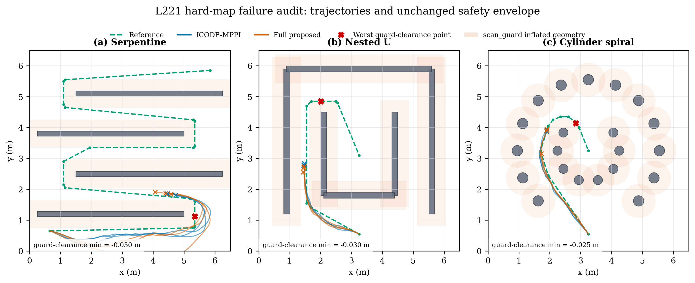

# L221 困难地图失败根因审计（开发数据）

日期：2026-07-20

性质：development qualification diagnostic，不是 sealed confirmation

运行 Git：`4a19aeeeec89e469587dfc734641585f5b927e80`

## 1. 审计对象

L221 完整开发 Gate 包含 3 个重复使用的 development seeds、6 张 MuJoCo
地图和 3 个等预算方法，共 54 回合。所有回合均经过 provenance、MuJoCo
3.2.3、ICODE checkpoint、Actor checkpoint、`K=30`、1 iteration 和逐回合
工件完整性检查。统计独立单位为 seed；地图是 seed 内重复 strata。

冻结 Gate 的结果为 `development_gate_failed`。已经满足：零碰撞、Full 不
劣于 ICODE 的预设均值阈值、Full 显著优于 Simple、原成功地图没有回退、
Actor support/proposal authority 非零。唯一未满足的条件是三个既往失败
地图没有成功率提升或大于 0.10 的完成度提升。

## 2. 几何一致性审计

离线几何审计只用于验证手工参考路径；在线 planner 从未获得 MuJoCo 障碍
真值，障碍输入仍为 `LaserScan -> local_obstacle_layer`。

| 场景 | 0.25 m 车体净空 | 0.38 m scan_guard 净空 | 结论 |
|---|---:|---:|---|
| Serpentine | 0.100 m | -0.030 m | 物理可通，但参考线进入安全禁区 |
| Nested U | 0.100 m | -0.030 m | 物理可通，但参考线进入安全禁区 |
| Cylinder spiral | 0.105 m | -0.025 m | 物理可通，但参考线进入安全禁区 |

因此，旧场景只验证了车体不与 MuJoCo geometry 相交，没有验证参考线是否
符合更严格且必须保留的 `scan_guard.near_body_stop_radius=0.38 m`。

## 3. 执行轨迹证据

### Serpentine

- ICODE/Full 均为 0/3 成功、0 碰撞；
- 最后 200 步的 `front_obstacle_slow` 比例分别约 0.99 和 1.00；
- 最后 200 步仍移动约 0.62 m 和 0.52 m，但实际线速度只有约 0.031 和
  0.027 m/s；
- 这是持续安全限速与局部目标追逐造成的慢性停滞，不是单次碰撞。

### Nested U

- ICODE/Full 均为 0/3 成功、0 碰撞；
- 最后 200 步 `front_obstacle_slow` 比例约 0.99 和 0.96；
- 最终净空约 0.228 m 和 0.217 m；
- Full 的反事实 authority 约 0.00037，最终 proposal authority 为 0。

Actor 在 ICODE 反事实 rollout 中没有给出更好的长期提案，因此 L221 Gate
按设计拒绝 Actor。失败不是 Gate 误杀，而是 policy 没有长程路径信息。

### Cylinder spiral

- ICODE/Full 均为 0/3 成功、0 碰撞；
- 最后 200 步 `near_body_hard_stop` 比例约 0.977 和 0.973；
- 最后 200 步位移仅约 0.021 m 和 0.015 m，实际线速度约 0.001 m/s；
- Full 的 counterfactual authority 约 0.0037，proposal authority 为 0。

这是明确的安全硬停，而不是增加训练轮次或采样数即可解决的问题。

## 4. 规划结构根因

冻结配置使用 36 步、0.1 s 控制周期，即 3.6 s 预测时域。当前 MPPI 基础
cost 在整个 rollout 中反复评价同一个 0.4--0.45 m lookahead target；它
没有让第 h 个预测状态对应第 h 个未来路径点。Actor 虽然具有局部
cross-track、curvature 和 remaining 特征，但也没有多个未来路径点。

因此 U 型、折返和螺旋任务要求的“提前转向、短期绕远、长期沿路径前进”
既没有被共享 MPPI cost 完整表达，也没有提供给 learned Actor。

## 5. 结论与范围

本次结果没有否定 ICODE，也没有证明核心耦合无效。L221 已消除 Actor 在
原成功地图上的回退并保留非零耦合权；困难地图失败由两项可证伪的平台
问题解释：参考路径违反不可关闭的安全包络，以及 planner/policy 缺少多点
路径预览。

后续 L222 不覆盖旧结果、不降低安全阈值、不向在线 planner 提供障碍真值。
它将以新版本配置修复任务参考，并把同一多点 path-preview 表示公平提供给
所有 MPPI arms 和 residual-conditioned Actor。

## 6. 可复现工件

- `docs/rl/artifacts/l221/development_gate/`
- `docs/rl/artifacts/l221/failure_modes/root_cause_scene_audit.csv`
- `docs/rl/artifacts/l221/failure_modes/trajectory_stagnation_audit.csv`
- `docs/rl/artifacts/l221/failure_modes/trajectory_stagnation_summary.csv`
- `docs/rl/artifacts/l221/failure_modes/root_cause_audit.json`
- `experiments/rl/analyze_l221_failure_modes.py`
